# EthPay

## Get your MongoDB URI
Go back to your database on MongoDB Atlas, click on Connect button
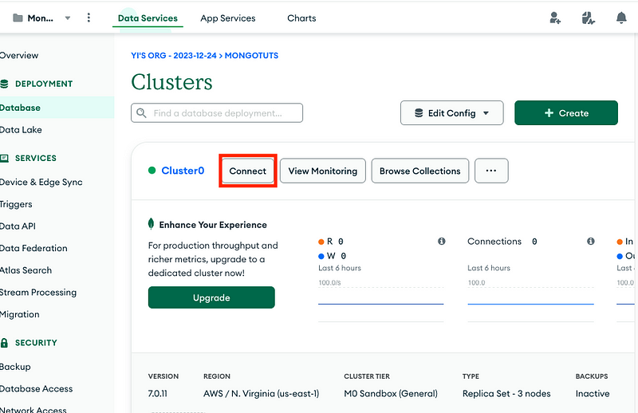

Click on “Connect to your application”
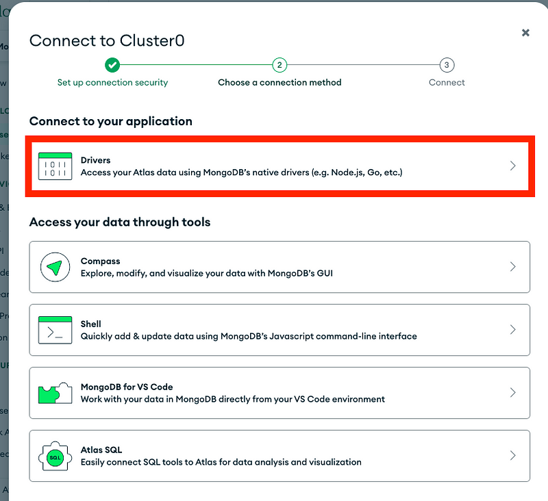

Copy the MongoDB URI and fill in the <username> and <password> with the username and password you saved before
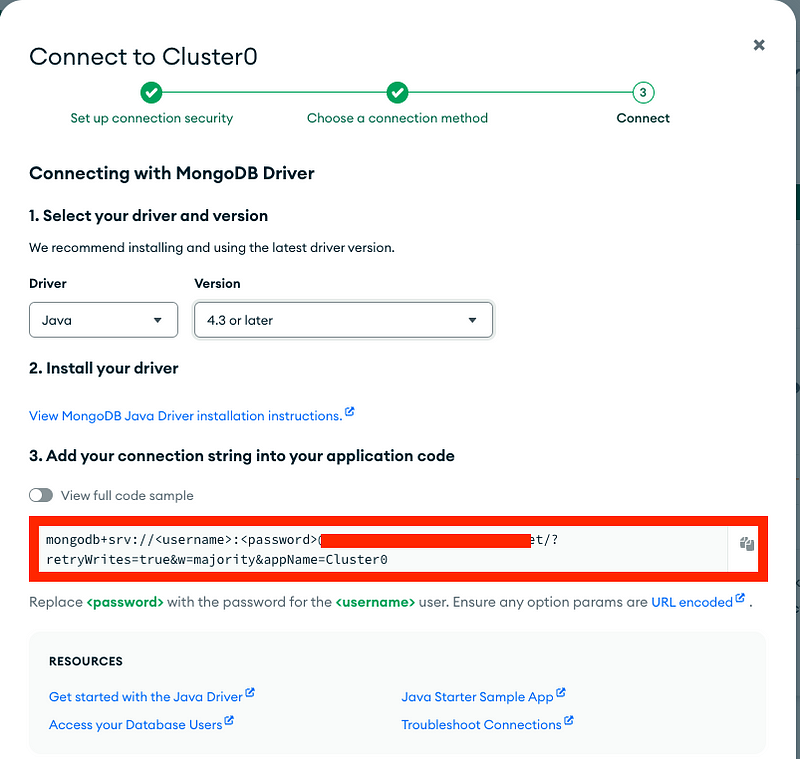

## Developing Locally in Docker
### Setting up Environment Variables
Run the following command to create a .env file which will initialize the environment variables
```bash
cp .env.example .env
```
In the .env file fill in the following environment variables
```text
export MONGO_DATABASE_URI=<Your MongoDB URI>
export JWT_ACCESS_SECRET_KEY=<Your JWT Access Secret Key>
export JWT_REFRESH_SECRET_KEY=<Your JWT Refresh Secret Key>
```

### Running Docker Compose
In the current workspace run the following in your terminal initialize Docker swam
```bash
docker swarm init
```

Run the following command to build and setup Docker compose
```bash
docker-compose build
```

Run the following command to start the Docker compose
```bash
docker-compose up
```

### Configure IntelliJ IDEA for Remote Debugging in Docker
Open IntelliJ IDEA.
1. Go to Run > Edit Configurations.
2. Click the + icon and select Remote JVM Debug.
3. Set the following configuration:
   - Name: Remote Debug
   - Host: localhost
   - Port: 5005
4. Click Apply and OK.
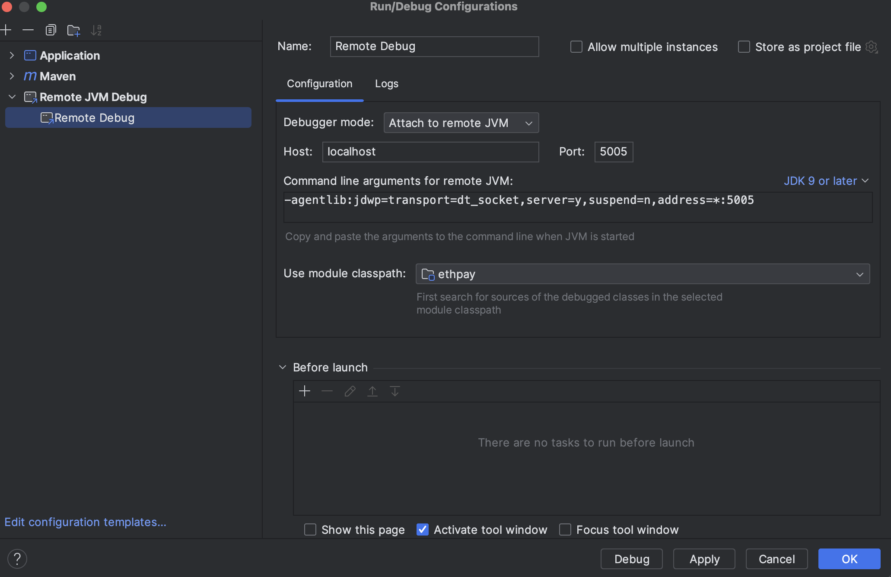

Run the following command to ssh into your Docker container
```bash
docker exec -it ethpay-application sh
```

Once you are in the Docker container run the 
following command to run your application in debug mode
```bash
./debug.sh
```

Then in Intellij Idea 
- Go to Run > Debug 'Remote Debug'

## Deploy to Render
### Setting up Environment Variables
Go to your Java application on https://dashboard.render.com/ , in Environment. 
Add the Environmental Variable, 
- MONGO_DATABASE_URI: <Your MongoDB URI>
- JWT_ACCESS_SECRET_KEY: <Your JWT Access Secret Key>
- JWT_REFRESH_SECRET_KEY: <Your JWT Refresh Secret Key>
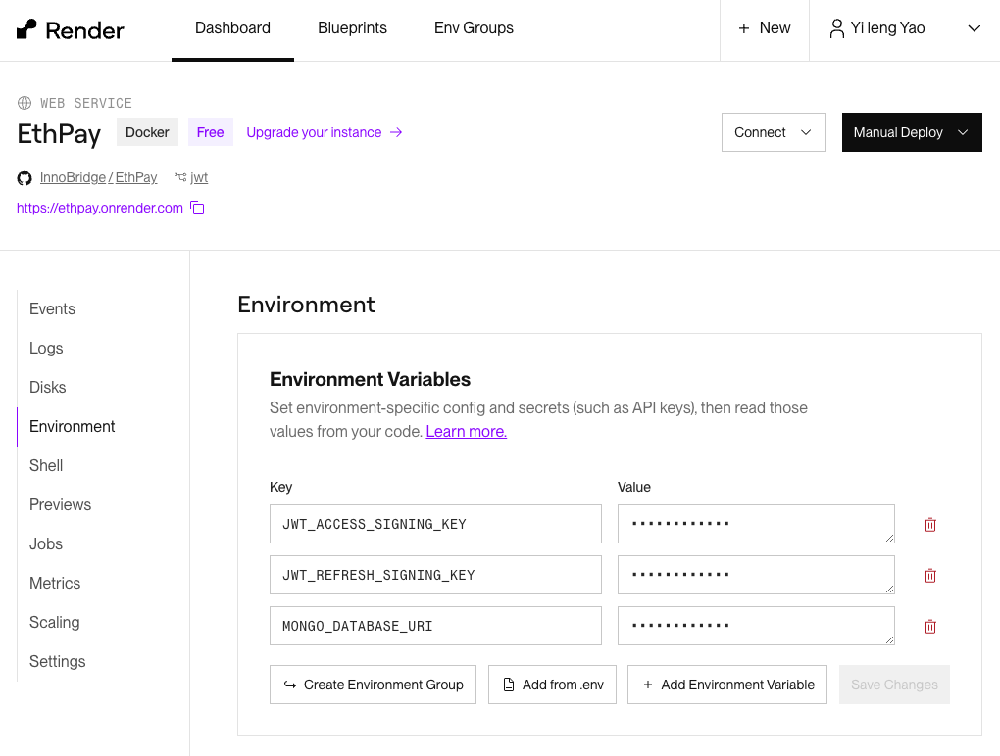

### Whitelist Application’s IP Address
Whitelisting our Spring Boot application’s IP Address on MongoDB Atlas adds an extra layer of security, because we only want our Spring Boot application to access our database and don’t want to allow public access to our database.
On https://dashboard.render.com/ click on Connect to obtain the set of Static Outbound IP Addresses.
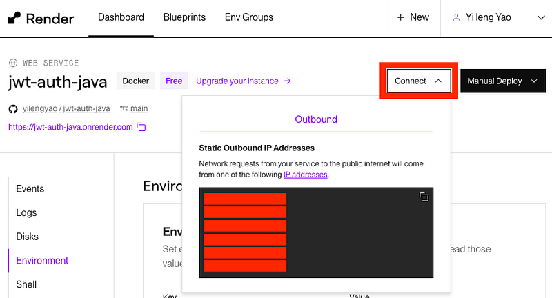

No go back to your database on MongoDB Atlas, click on the sidebar tab Network Access and add all the Static Outbound IP Addresses.
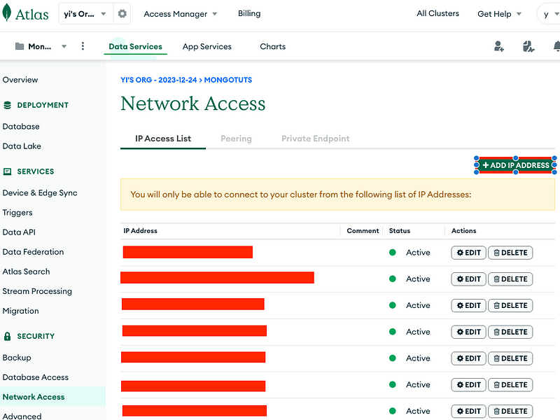

Push your code to the main branch of your Spring Boot GitHub repo. When we integrate our GitHub repo with Render as described in the previous tutorial, the default setup triggers a build every time we push code to the main branch.

After the deployment has completed you can execute your api on 
```text
https://<application url>/swagger-ui/index.html.
```

# OAuth 2.0 Authentication (OpenID)
## Setting up Google OAuth 2.0
1. Go to the Google Cloud Console: Navigate to [Google Cloud Console](https://console.cloud.google.com/).
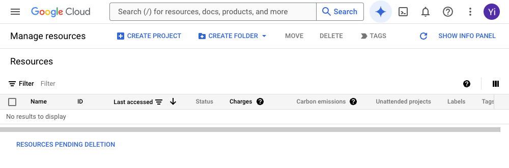
2. Create OAuth consent screen, on the left sidebar go to OAuth Consent Screen. Fill in:
- - App name
- User support email
- Upload App logo
- Add App domain name
- Add Authorized Domain
- Developer contact information email
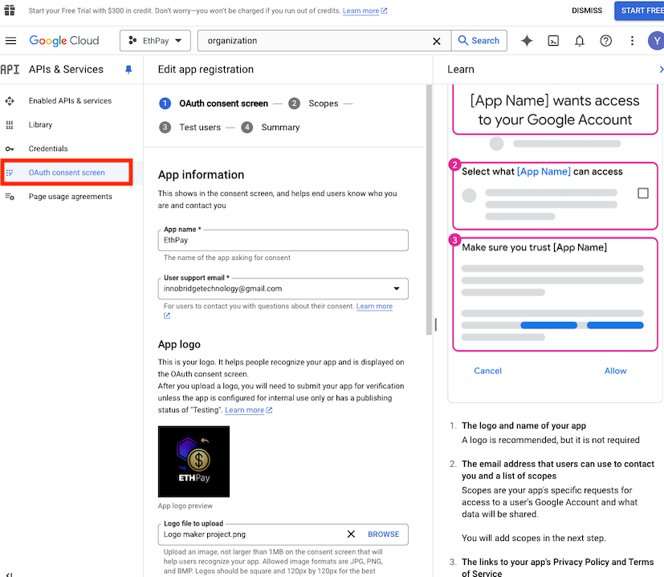
3. Navigate to `APIs & Services > Credentials`. Create Credentials
[alt text](./images/Google-API-Services-Create-Credentials.png)
- When ask for Choose `OAuth client ID`.
- Application type: Web application
- Add Authorize redirect URIs 
- - http://localhost:8080/login/oauth2/code/google
- - https://<application url>/login/oauth2/code/google
- Then create OAuth 2.0 Client IDs with appropriate redirect
- Download the client secret file.
4. Go to https://dashboard.render.com/
Add the following environment variables
- GOOGLE_CLIENT_ID: <Your Google Client ID>
- GOOGLE_CLIENT_SECRET: <Your Google Client Secret>
- GOOGLE_REDIRECT_BASE_URI: <Your Google Redirect URI>

## Signing in with Google
To sign in with Google, go to the following URL
```text
https://<application url>/oauth2/authorization/google
```
It will return the JWT access token in the response body and the refresh token in the httpOnly cookie named `refresh-token`.

# Usage
You can access the OpenAPI UI for calling the endpoints by going to `http://<base-url>/swagger-ui/index.html` in your browser.
## POST `/auth/signup`
This api is used to register a new user. The request body should contain the following fields:
```json
{
  "username": "username",
  "email": "email",
  "password": "password"
}
```
The uri is whitelisted, you don't need to provide any authentication token or credential to register the user.

## POST `/auth/signin`
This api is used to login a user. The use will need to provide
- a username or email
- a password
```json
{
  "username": <string>, 
   "email": <string>,
  "password": <string>
}
```
When the user has successfully logged in, an access and refresh token will be generated and stored server side.
The access token will be returned in the response body:
```json
{
  "accessToken": <string>,
  "expiresIn": <number>
}
```
A refresh token will also be returned as an httpOnly cookie with the name `refresh-token`.
This is because the refresh token is longer lived than the access token and has stricter security requirements.
Because the refresh token can be used to generate a new access token, it is important to keep it secure.
Returning the refresh token in the response body is not a security risk because it can be stolen through 
cross-site scripting attacks.

## POST `/auth/refresh`
This api is used to refresh the access token. The user will need to provide the refresh token in the httpOnly cookie named `refresh-token`.
Once authenticated using the refresh token a response with the access token will be returned.
```json
{
   "accessToken": <string>,
   "expiresIn": <number>
}
```
The access old access token in storage will be replaced by the new access token.

## POST `/auth/signout`
This api is used to logout the user. The user will need to provide the refresh token in the httpOnly cookie named `refresh-token`.
Once authenticated using the refresh token, the refresh and access token will be deleted from storage. And the refresh token in the 
user's browser will be deleted.

## Add access token to the request header
On OpenAPI UI, click on the Authorize button and add the access token.
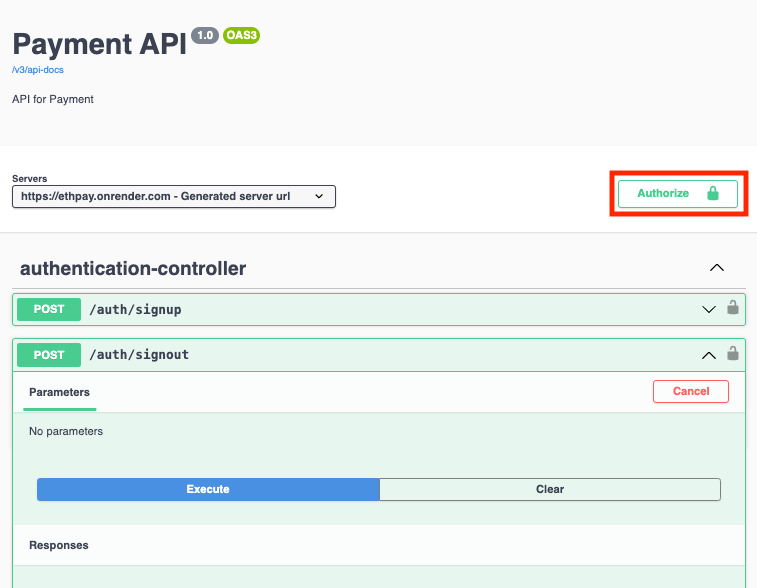
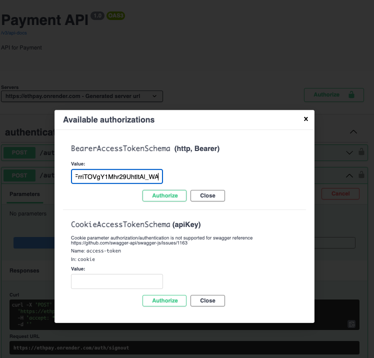
